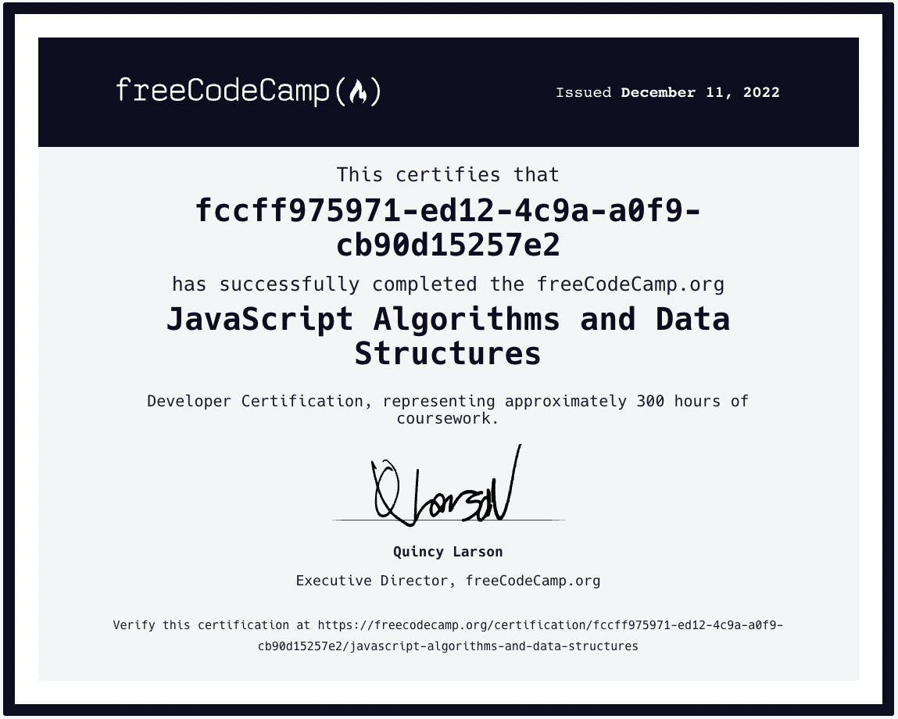

# freeCodeCamp Algorithms and Data Structures Course Notes

This is a collection of problem solutions completed while taking the [freeCodeCamp JavaScript Algorithms and Data Structures Course](https://www.freecodecamp.org/learn/javascript-algorithms-and-data-structures/).

